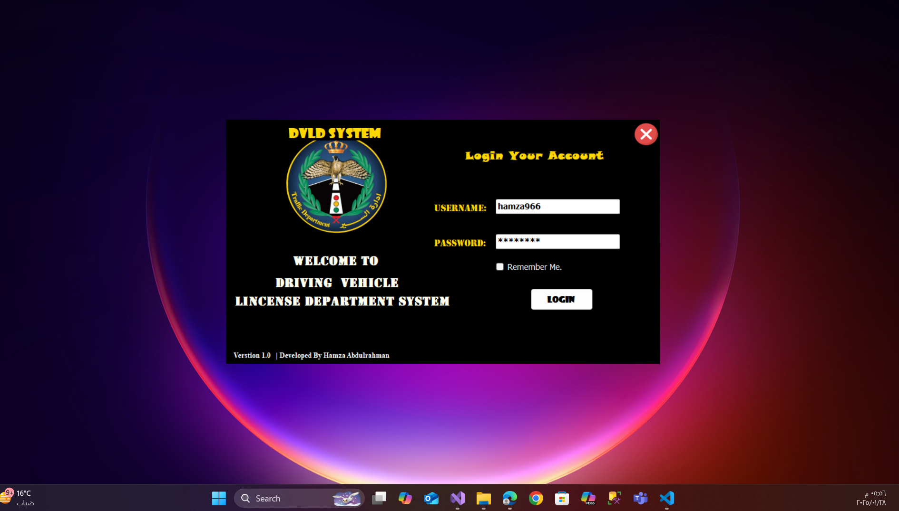
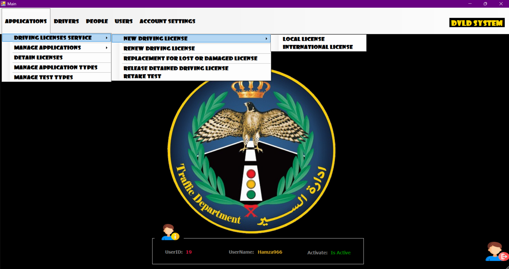

# Driving & Vehicle License Department (DVLD) System

The **DVLD System** is a comprehensive solution designed to manage and streamline the processes related to driver and vehicle licensing. This system provides a robust platform for issuing, renewing, and managing driver licenses, as well as handling various related services such as license replacement, international license issuance, and more.
     




## Table of Contents

- [Features](#features)
- [Services Provided](#services-provided)
- [System Requirements](#system-requirements)
- [Installation](#installation)
- [Usage](#usage)
- [Contributing](#contributing)
- [License](#license)
- [Contact](#contact)

## Features

The DVLD System offers the following key features:

1. **Driver License Management:**
   - Issue new driver licenses for different vehicle categories.
   - Renew expired driver licenses.
   - Replace lost or damaged licenses.
   - Issue international driver licenses.
   - Manage license holds and releases.

2. **Applicant Management:**
   - Store and manage applicant information, including national ID, full name, date of birth, address, phone number, email, nationality, and photo.
   - Ensure no duplicate entries for applicants using their national ID.

3. **Application Management:**
   - Submit and track applications for various services.
   - Manage application status (new, processed, completed).
   - Filter applications based on their status.

4. **Testing and Examination:**
   - Schedule and manage medical, theoretical, and practical driving tests.
   - Record test results and fees.
   - Allow retakes for failed tests with additional fees.

5. **License Categories:**
   - Manage different license categories (e.g., motorcycles, cars, commercial vehicles, agricultural vehicles, buses, trucks).
   - Set minimum age requirements, validity periods, and fees for each category.

6. **User and Admin Management:**
   - Add, modify, and delete system users.
   - Assign permissions and roles to users.
   - Track user activities and changes made in the system.

7. **Reporting and Search:**
   - Search for licenses, applicants, and applications using national ID or license number.
   - Generate reports on issued licenses, pending applications, and test results.

8. **Fees and Payments:**
   - Manage fees for different services (e.g., license issuance, renewals, replacements, tests).
   - Track payments made by applicants.

## Services Provided

The DVLD System supports the following services:

1. **New License Issuance:**
   - Applicants can apply for a new driver license in one of the available categories.
   - The system ensures the applicant meets the age and eligibility requirements.

2. **License Renewal:**
   - Renew expired driver licenses after passing a vision test.

3. **License Replacement:**
   - Issue replacement licenses for lost or damaged licenses.

4. **International License Issuance:**
   - Issue international driver licenses for eligible applicants (only for Category 3 licenses).

5. **Test Retakes:**
   - Allow applicants to retake failed tests (medical, theoretical, or practical) by scheduling new appointments.

6. **License Hold and Release:**
   - Manage license holds and releases after payment of fines.

## System Requirements

- **Programming Language:** C#
- **Database:** [Specify the database, e.g., SQL Server, MySQL]
- **Framework:** [Specify the framework, e.g., .NET, ASP.NET]
- **Operating System:** Windows, Linux, or macOS (depending on the framework)

## Installation

To set up the DVLD System locally, follow these steps:

1. **Clone the repository:**
   ```bash
   git clone https://github.com/HamzaUpgrade/DLVD-SYSTEM.git
   cd DLVD-SYSTEM
   ```
2. **Restore the DVLD.bak on SQL Server**

3. **Open the DLVD_Project.sln file using Visual Studio**
